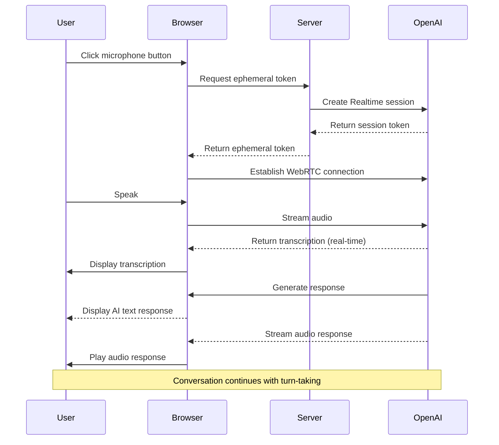

# Voice Integration Enhancement Plan: Real-time Conversational AI

Based on your feedback, I understand you want to leverage OpenAI's Realtime API for full speech-to-speech conversations, not just speech-to-text transcription. This plan outlines how to enhance the current implementation to support bidirectional voice conversations.

## Current State

We've successfully implemented:

- Speech-to-text transcription using OpenAI's Realtime API
- WebRTC connection for audio streaming
- UI components for recording and displaying transcriptions
- Database schema for storing voice sessions

However, the current implementation only supports one-way communication (user speaks → AI transcribes and responds with text).

## Enhancement Plan

### 1. Enable Speech-to-Speech Conversations

We need to modify the current implementation to:

- Enable audio output from the model
- Play the AI's spoken responses through the user's speakers
- Create a more conversational turn-taking interface

### 2. Technical Changes Required

#### API Configuration

- Update the session configuration to include both audio input and output modalities
- Configure the voice parameter for text-to-speech output
- Remove the `intent=transcription` parameter to enable full conversation mode

```javascript
// Session configuration update
{
  model: "gpt-4o-realtime",
  voice: "alloy", // or other voice options
  modalities: ["audio", "text"] // Enable both modalities
}
```

#### WebRTC Audio Handling

- Configure the WebRTC connection to handle bidirectional audio
- Process and play audio responses from the model
- Implement proper turn detection for conversation flow

#### UI Enhancements

- Add audio playback controls
- Create a visual indicator when the AI is speaking
- Implement a toggle for text/audio mode
- Add volume controls for AI speech

### 3. Component Updates

#### useVoiceCapture Hook

- Add handling for audio output events from the Realtime API
- Implement audio playback functionality
- Add state for tracking when the AI is speaking

```typescript
// Add to VoiceSessionState
interface VoiceSessionState {
  isConnected: boolean;
  isRecording: boolean;
  isProcessing: boolean;
  isAISpeaking: boolean; // New state
  voice: string;
}
```

#### VoiceConversation Component

- Create a new component for managing the conversation flow
- Display both user and AI transcriptions
- Show visual indicators for speaking turns

#### Message Component

- Update to support audio playback for AI messages
- Add play/pause controls for voice messages

### 4. Database Schema Updates

- Add fields to track conversation audio data
- Store references to audio files for playback

```sql
-- Add to voice_sessions table
ALTER TABLE voice_sessions ADD COLUMN audio_enabled BOOLEAN NOT NULL DEFAULT true;

-- Add table for AI audio responses
CREATE TABLE voice_responses (
  id UUID PRIMARY KEY DEFAULT gen_random_uuid(),
  session_id UUID REFERENCES voice_sessions(id) ON DELETE CASCADE,
  message_id UUID REFERENCES message(id) ON DELETE CASCADE,
  audio_url TEXT,
  duration_seconds INTEGER,
  created_at TIMESTAMP NOT NULL DEFAULT CURRENT_TIMESTAMP
);
```

## Implementation Steps

### 1. Update API Configuration

First, we need to modify the session creation endpoint to support full conversation mode:

```typescript
// app/api/voice/session/route.ts
const response = await fetch("https://api.openai.com/v1/realtime/sessions", {
  method: "POST",
  headers: {
    Authorization: `Bearer ${process.env.OPENAI_API_KEY}`,
    "Content-Type": "application/json",
    "OpenAI-Beta": "realtime=v1",
  },
  body: JSON.stringify({
    model: "gpt-4o-realtime",
    voice: voice,
    // Remove intent=transcription
    // Add configuration for conversation
    turn_detection: {
      type: "server_vad",
      threshold: 0.5,
      prefix_padding_ms: 300,
      silence_duration_ms: 500,
      create_response: true, // Auto-respond when user stops speaking
      interrupt_response: true, // Allow interruptions
    },
  }),
});
```

### 2. Update useVoiceCapture Hook

Next, enhance the hook to handle audio output:

```typescript
// hooks/use-voice-capture.ts

// Add to handleRealtimeEvent
switch (data.type) {
  // ... existing cases

  case "response.audio.delta":
    // Handle audio chunks from the model
    if (data.delta) {
      // Play audio chunk
      playAudioChunk(data.delta);
      setState((prev) => ({ ...prev, isAISpeaking: true }));
    }
    break;

  case "response.audio.done":
    // Audio response complete
    setState((prev) => ({ ...prev, isAISpeaking: false }));
    break;
}

// Add audio playback function
const playAudioChunk = (base64Audio: string) => {
  // Convert base64 to audio buffer
  const audioData = atob(base64Audio);
  const arrayBuffer = new ArrayBuffer(audioData.length);
  const view = new Uint8Array(arrayBuffer);
  for (let i = 0; i < audioData.length; i++) {
    view[i] = audioData.charCodeAt(i);
  }

  // Create audio context and play
  const audioContext = new (window.AudioContext || window.webkitAudioContext)();
  audioContext.decodeAudioData(arrayBuffer, (buffer) => {
    const source = audioContext.createBufferSource();
    source.buffer = buffer;
    source.connect(audioContext.destination);
    source.start(0);
  });
};
```

### 3. Update WebRTC Connection

Remove the `intent=transcription` parameter and configure for bidirectional audio:

```typescript
// hooks/use-voice-capture.ts
const baseUrl = "https://api.openai.com/v1/realtime";
const model = "gpt-4o-realtime";
// Remove intent=transcription
const sdpResponse = await fetch(`${baseUrl}?model=${model}`, {
  method: "POST",
  body: offer.sdp,
  headers: {
    Authorization: `Bearer ${EPHEMERAL_KEY}`,
    "Content-Type": "application/sdp",
    "OpenAI-Beta": "realtime=v1",
  },
});
```

### 4. Create VoiceConversation Component

Create a new component for the conversation interface:

```tsx
// components/voice-conversation.tsx
"use client";

import { useState, useEffect } from "react";
import { useVoiceCapture } from "@/hooks/use-voice-capture";
import { VoiceRecordButton } from "./voice-record-button";
import { TranscriptionDisplay } from "./transcription-display";

interface VoiceConversationProps {
  chatId: string;
  onTranscriptionComplete: (text: string) => void;
}

export function VoiceConversation({
  chatId,
  onTranscriptionComplete,
}: VoiceConversationProps) {
  const [userTranscript, setUserTranscript] = useState("");
  const [aiTranscript, setAiTranscript] = useState("");

  const {
    isConnected,
    isRecording,
    isProcessing,
    isAISpeaking,
    voice,
    startRecording,
    stopRecording,
    setVoice,
  } = useVoiceCapture({
    chatId,
    onTranscription: (text) => {
      setUserTranscript((prev) => prev + text);
    },
    onAIResponse: (text) => {
      setAiTranscript((prev) => prev + text);
    },
  });

  // Handle stopping recording
  const handleStopRecording = () => {
    stopRecording();
    if (userTranscript.trim()) {
      onTranscriptionComplete(userTranscript);
    }
  };

  return (
    <div className="voice-conversation">
      <div className="flex items-center justify-between mb-4">
        <h3 className="text-lg font-medium">Voice Conversation</h3>
        <select
          value={voice}
          onChange={(e) => setVoice(e.target.value)}
          className="select select-sm"
        >
          <option value="alloy">Alloy</option>
          <option value="echo">Echo</option>
          <option value="fable">Fable</option>
          <option value="onyx">Onyx</option>
          <option value="nova">Nova</option>
          <option value="shimmer">Shimmer</option>
        </select>
      </div>

      {/* User's speech */}
      <div className="mb-4">
        <div className="flex items-center gap-2 mb-2">
          <div className="size-8 rounded-full bg-blue-500 flex items-center justify-center">
            <span className="text-white">You</span>
          </div>
          {isRecording && (
            <div className="animate-pulse bg-red-500 rounded-full h-3 w-3"></div>
          )}
        </div>
        <TranscriptionDisplay
          transcription={userTranscript}
          isRecording={isRecording}
          isProcessing={isProcessing}
          className="mb-2"
        />
      </div>

      {/* AI's speech */}
      {aiTranscript && (
        <div className="mb-4">
          <div className="flex items-center gap-2 mb-2">
            <div className="size-8 rounded-full bg-purple-500 flex items-center justify-center">
              <span className="text-white">AI</span>
            </div>
            {isAISpeaking && (
              <div className="animate-pulse bg-purple-500 rounded-full h-3 w-3"></div>
            )}
          </div>
          <div className="p-3 bg-gray-100 dark:bg-gray-800 rounded-lg">
            {aiTranscript}
          </div>
        </div>
      )}

      {/* Controls */}
      <div className="flex justify-center mt-4">
        <VoiceRecordButton
          onStartRecording={startRecording}
          onStopRecording={handleStopRecording}
          isRecording={isRecording}
          isProcessing={isProcessing}
          disabled={isAISpeaking}
        />
      </div>
    </div>
  );
}
```

### 5. Integrate with MultimodalInput

Update the MultimodalInput component to use the new conversation mode:

```tsx
// components/multimodal-input.tsx
// Add a toggle for voice conversation mode
const [voiceConversationMode, setVoiceConversationMode] = useState(false);

// In the return statement
return (
  <div className="relative w-full flex flex-col gap-4">
    {/* ... existing code ... */}

    {voiceConversationMode ? (
      <VoiceConversation
        chatId={chatId}
        onTranscriptionComplete={(text) => {
          setInput(text);
          submitForm();
        }}
      />
    ) : (
      <>
        {/* Existing input UI */}
        <Textarea
          data-testid="multimodal-input"
          ref={textareaRef}
          placeholder="Send a message..."
          value={input}
          onChange={handleInput}
          className={cx(
            "min-h-[24px] max-h-[calc(75dvh)] overflow-hidden resize-none rounded-2xl !text-base bg-muted pb-10 dark:border-zinc-700",
            className
          )}
          rows={2}
          autoFocus
          onKeyDown={/* ... existing code ... */}
        />
      </>
    )}

    {/* Add voice mode toggle */}
    <div className="absolute bottom-0 p-2 w-fit flex flex-row justify-start gap-1">
      <AttachmentsButton fileInputRef={fileInputRef} status={status} />
      {chatType === "capture" && (
        <>
          <VoiceRecordButton
            onStartRecording={handleStartRecording}
            onStopRecording={handleStopRecording}
            isRecording={isRecording}
            isProcessing={isProcessing}
            disabled={status !== "ready" || voiceConversationMode}
          />
          <Button
            size="sm"
            variant={voiceConversationMode ? "default" : "ghost"}
            onClick={() => setVoiceConversationMode(!voiceConversationMode)}
            className="rounded-md p-[7px] h-fit"
          >
            <HeadphonesIcon size={14} />
          </Button>
        </>
      )}
    </div>

    {/* ... existing code ... */}
  </div>
);
```

## Technical Approach



## Timeline and Priorities

1. **Phase 1: Basic Audio Output (1-2 days)**

   - Update API configuration
   - Implement audio playback
   - Test basic bidirectional communication

2. **Phase 2: Conversation UI (2-3 days)**

   - Create VoiceConversation component
   - Implement turn-taking indicators
   - Add voice selection

3. **Phase 3: Database and Storage (1-2 days)**

   - Update database schema
   - Implement audio storage
   - Add playback controls for stored conversations

4. **Phase 4: Testing and Refinement (2-3 days)**
   - Test across different browsers
   - Optimize audio quality
   - Refine user experience

## Conclusion

This enhancement will transform the current speech-to-text functionality into a full speech-to-speech conversational experience, leveraging the full capabilities of OpenAI's Realtime API. Users will be able to have natural voice conversations with the AI, making the capture process more intuitive and efficient.
