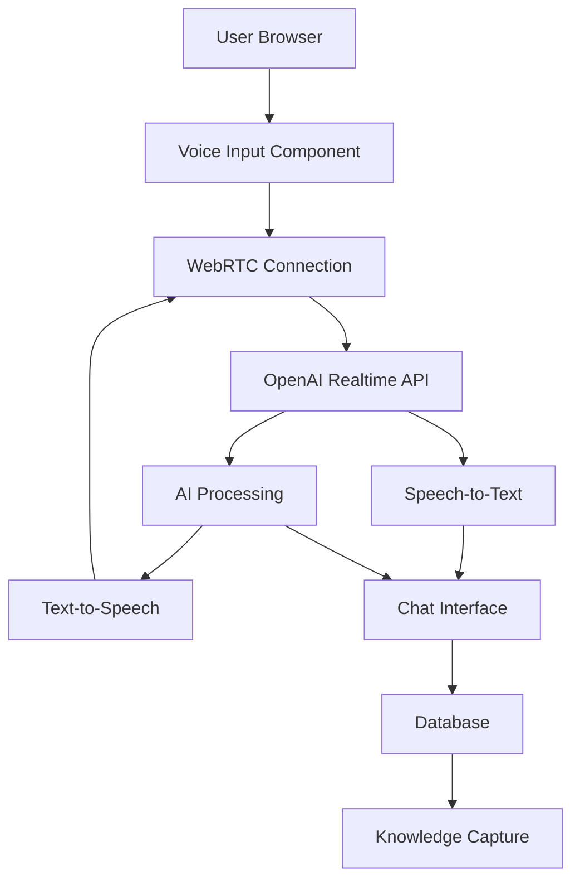

# Voice Interview Integration Plan

## Overview

This document outlines the plan to incorporate OpenAI's Realtime API into our AI chatbot application to enable real-time voice interviews. This integration will allow users to have spoken conversations with the AI, enhancing the knowledge capture experience.

## Current System Overview

Our application has:

- A Next.js frontend with a chat interface
- A "capture" mode specifically for knowledge capture
- Text input via the MultimodalInput component
- File attachment capabilities
- Backend API routes that process messages and generate responses
- Database storage for chat messages and artifacts

## Voice Integration Goals

1. Enable users to have real-time voice conversations with the AI
2. Transcribe user speech in real-time
3. Generate AI responses as both text and speech
4. Maintain the existing knowledge capture functionality
5. Provide a seamless user experience

## Technical Architecture



## Implementation Plan

### 1. Set Up OpenAI Realtime API Integration

1. Create a server endpoint to generate ephemeral API tokens
   - This will secure your OpenAI API key while allowing browser-based connections
   - Implement token generation with appropriate session validation

```typescript
// app/api/voice/session/route.ts
import { auth } from "@/app/(auth)/auth";

export async function POST(request: Request) {
  const session = await auth();

  if (!session || !session.user || !session.user.id) {
    return new Response("Unauthorized", { status: 401 });
  }

  try {
    // Request an ephemeral token from OpenAI
    const response = await fetch(
      "https://api.openai.com/v1/realtime/sessions",
      {
        method: "POST",
        headers: {
          Authorization: `Bearer ${process.env.OPENAI_API_KEY}`,
          "Content-Type": "application/json",
        },
        body: JSON.stringify({
          model: "gpt-4o-realtime-preview-2024-12-17",
          voice: "alloy", // Default voice
        }),
      }
    );

    const data = await response.json();
    return Response.json(data);
  } catch (error) {
    console.error("Error creating voice session:", error);
    return new Response("Error creating voice session", { status: 500 });
  }
}
```

2. Set up WebRTC connection handling
   - Create a new component for managing WebRTC connections
   - Implement peer connection setup with the Realtime API
   - Handle audio tracks and data channels

### 2. Create Voice Input UI Components

1. Add a microphone button to the MultimodalInput component
   - Create a new VoiceRecordButton component
   - Add visual indicators for recording state (idle, recording, processing)

```tsx
// components/voice-record-button.tsx
"use client";

import { useState } from "react";
import { Button } from "./ui/button";
import { MicrophoneIcon, StopIcon } from "./icons";

export function VoiceRecordButton({
  onStartRecording,
  onStopRecording,
  isRecording,
  disabled,
}: {
  onStartRecording: () => void;
  onStopRecording: () => void;
  isRecording: boolean;
  disabled: boolean;
}) {
  return (
    <Button
      data-testid="voice-record-button"
      className={`rounded-md p-[7px] h-fit ${
        isRecording ? "bg-red-500 hover:bg-red-600" : ""
      }`}
      onClick={(event) => {
        event.preventDefault();
        if (isRecording) {
          onStopRecording();
        } else {
          onStartRecording();
        }
        // Ensure keyboard is dismissed on mobile
        document.activeElement instanceof HTMLElement &&
          document.activeElement.blur();
      }}
      disabled={disabled}
      variant={isRecording ? "default" : "ghost"}
    >
      {isRecording ? <StopIcon size={14} /> : <MicrophoneIcon size={14} />}
    </Button>
  );
}
```

2. Implement voice recording functionality
   - Use browser's MediaDevices API to access the microphone
   - Add the audio track to the WebRTC peer connection
   - Implement voice activity detection (VAD) handling

### 3. Create Core Voice Manager Component

```tsx
// components/voice-manager.tsx
"use client";

import { useEffect, useRef, useState } from "react";
import { toast } from "sonner";

export function VoiceManager({
  chatId,
  onTranscription,
  onAIResponse,
}: {
  chatId: string;
  onTranscription: (text: string) => void;
  onAIResponse: (text: string) => void;
}) {
  const [isConnected, setIsConnected] = useState(false);
  const [isRecording, setIsRecording] = useState(false);
  const pcRef = useRef<RTCPeerConnection | null>(null);
  const dcRef = useRef<RTCDataChannel | null>(null);
  const audioElRef = useRef<HTMLAudioElement | null>(null);

  // Initialize WebRTC connection
  const initializeConnection = async () => {
    try {
      // Get ephemeral token from our server
      const tokenResponse = await fetch("/api/voice/session", {
        method: "POST",
      });
      const data = await tokenResponse.json();
      const EPHEMERAL_KEY = data.client_secret.value;

      // Create peer connection
      const pc = new RTCPeerConnection();
      pcRef.current = pc;

      // Set up audio element for playback
      const audioEl = new Audio();
      audioEl.autoplay = true;
      audioElRef.current = audioEl;

      // Handle incoming audio tracks
      pc.ontrack = (e) => {
        if (audioElRef.current) {
          audioElRef.current.srcObject = e.streams[0];
        }
      };

      // Set up data channel for events
      const dc = pc.createDataChannel("oai-events");
      dcRef.current = dc;

      dc.addEventListener("message", handleRealtimeEvent);

      // Create and set local description (offer)
      const offer = await pc.createOffer();
      await pc.setLocalDescription(offer);

      // Connect to OpenAI Realtime API
      const baseUrl = "https://api.openai.com/v1/realtime";
      const model = "gpt-4o-realtime-preview-2024-12-17";
      const sdpResponse = await fetch(`${baseUrl}?model=${model}`, {
        method: "POST",
        body: offer.sdp,
        headers: {
          Authorization: `Bearer ${EPHEMERAL_KEY}`,
          "Content-Type": "application/sdp",
        },
      });

      // Set remote description (answer)
      const answer = {
        type: "answer",
        sdp: await sdpResponse.text(),
      };
      await pc.setRemoteDescription(answer as RTCSessionDescriptionInit);

      setIsConnected(true);
      toast.success("Voice connection established");
    } catch (error) {
      console.error("Failed to initialize voice connection:", error);
      toast.error("Failed to connect voice service");
    }
  };

  // Handle events from the Realtime API
  const handleRealtimeEvent = (event: MessageEvent) => {
    try {
      const data = JSON.parse(event.data);

      // Handle different event types
      switch (data.type) {
        case "session.created":
          console.log("Voice session created:", data);
          break;

        case "input_audio_buffer.speech_started":
          console.log("Speech detected");
          break;

        case "input_audio_buffer.speech_stopped":
          console.log("Speech ended");
          break;

        case "response.audio_transcript.delta":
          // Handle real-time transcription
          if (data.delta) {
            onTranscription(data.delta);
          }
          break;

        case "response.text.delta":
          // Handle AI response text
          if (data.delta) {
            onAIResponse(data.delta);
          }
          break;

        case "error":
          console.error("Realtime API error:", data);
          toast.error("Voice service error");
          break;
      }
    } catch (error) {
      console.error("Error handling realtime event:", error);
    }
  };

  // Start recording from microphone
  const startRecording = async () => {
    try {
      if (!pcRef.current) {
        await initializeConnection();
      }

      // Get microphone access
      const stream = await navigator.mediaDevices.getUserMedia({ audio: true });

      // Add audio track to peer connection
      stream.getAudioTracks().forEach((track) => {
        pcRef.current?.addTrack(track, stream);
      });

      setIsRecording(true);
      toast.success("Recording started");
    } catch (error) {
      console.error("Failed to start recording:", error);
      toast.error("Failed to access microphone");
    }
  };

  // Stop recording
  const stopRecording = () => {
    if (pcRef.current) {
      // Remove all audio senders
      const senders = pcRef.current.getSenders();
      senders.forEach((sender) => {
        if (sender.track && sender.track.kind === "audio") {
          sender.track.stop();
          pcRef.current?.removeTrack(sender);
        }
      });
    }

    setIsRecording(false);
    toast.success("Recording stopped");
  };

  // Clean up on unmount
  useEffect(() => {
    return () => {
      if (pcRef.current) {
        pcRef.current.close();
      }
      if (audioElRef.current) {
        audioElRef.current.srcObject = null;
      }
    };
  }, []);

  return {
    isConnected,
    isRecording,
    startRecording,
    stopRecording,
  };
}
```

### 4. Enhance Backend for Voice Processing

1. Create a new API route for voice sessions

   - Implement `/api/voice/session` for creating ephemeral tokens
   - Handle session initialization and configuration

2. Modify the capture chat route to support voice transcriptions
   - Update the data model to store transcriptions
   - Ensure voice messages are properly saved alongside text messages

### 5. Implement Real-time Transcription Display

1. Create a TranscriptionDisplay component
   - Show real-time transcription as the user speaks
   - Allow editing of transcriptions before submission

```tsx
// components/transcription-display.tsx
"use client";

import { useState, useEffect } from "react";
import { Textarea } from "./ui/textarea";

export function TranscriptionDisplay({
  transcription,
  isRecording,
  onEdit,
}: {
  transcription: string;
  isRecording: boolean;
  onEdit: (text: string) => void;
}) {
  const [editableText, setEditableText] = useState(transcription);

  useEffect(() => {
    setEditableText(transcription);
  }, [transcription]);

  const handleChange = (e: React.ChangeEvent<HTMLTextAreaElement>) => {
    setEditableText(e.target.value);
    onEdit(e.target.value);
  };

  return (
    <div className="relative w-full">
      <Textarea
        value={editableText}
        onChange={handleChange}
        className={`min-h-[60px] max-h-[200px] overflow-auto resize-none rounded-md p-3 ${
          isRecording ? "border-red-500 border-2" : ""
        }`}
        placeholder="Transcription will appear here..."
        disabled={isRecording}
      />
      {isRecording && (
        <div className="absolute top-2 right-2">
          <div className="animate-pulse bg-red-500 rounded-full h-3 w-3"></div>
        </div>
      )}
    </div>
  );
}
```

2. Update the Messages component to display voice interactions
   - Add visual indicators for voice messages
   - Show transcriptions alongside text messages

### 6. Integrate with MultimodalInput Component

```tsx
// Modified MultimodalInput component with voice capabilities
import { VoiceRecordButton } from "./voice-record-button";
import { TranscriptionDisplay } from "./transcription-display";
import { useVoiceCapture } from "@/hooks/use-voice-capture";

// Add to existing MultimodalInput component
function PureMultimodalInput(
  {
    // ... existing props
  }
) {
  // ... existing code

  const [transcription, setTranscription] = useState("");
  const [showTranscription, setShowTranscription] = useState(false);

  const { isRecording, startRecording, stopRecording, isConnected } =
    useVoiceCapture({
      chatId,
      onTranscription: (text) => {
        setTranscription((prev) => prev + text);
      },
      onAIResponse: (text) => {
        // Handle AI response text
      },
    });

  const handleStartRecording = () => {
    setShowTranscription(true);
    setTranscription("");
    startRecording();
  };

  const handleStopRecording = () => {
    stopRecording();
    // Optionally set input with transcription
    setInput(transcription);
  };

  const handleTranscriptionEdit = (text: string) => {
    setTranscription(text);
  };

  return (
    <div className="relative w-full flex flex-col gap-4">
      {/* ... existing code */}

      {showTranscription && (
        <TranscriptionDisplay
          transcription={transcription}
          isRecording={isRecording}
          onEdit={handleTranscriptionEdit}
        />
      )}

      <Textarea
      // ... existing textarea props
      />

      <div className="absolute bottom-0 p-2 w-fit flex flex-row justify-start">
        <AttachmentsButton fileInputRef={fileInputRef} status={status} />
        <VoiceRecordButton
          onStartRecording={handleStartRecording}
          onStopRecording={handleStopRecording}
          isRecording={isRecording}
          disabled={status !== "ready" || !isConnected}
        />
      </div>

      {/* ... existing code */}
    </div>
  );
}
```

### 7. Create Voice Capture Hook

```typescript
// hooks/use-voice-capture.ts
"use client";

import { useState, useEffect, useRef } from "react";
import { toast } from "sonner";

export function useVoiceCapture({
  chatId,
  onTranscription,
  onAIResponse,
}: {
  chatId: string;
  onTranscription: (text: string) => void;
  onAIResponse: (text: string) => void;
}) {
  const [isConnected, setIsConnected] = useState(false);
  const [isRecording, setIsRecording] = useState(false);
  const pcRef = useRef<RTCPeerConnection | null>(null);
  const dcRef = useRef<RTCDataChannel | null>(null);
  const audioElRef = useRef<HTMLAudioElement | null>(null);

  // Initialize WebRTC connection
  const initializeConnection = async () => {
    try {
      // Get ephemeral token from our server
      const tokenResponse = await fetch("/api/voice/session", {
        method: "POST",
        headers: {
          "Content-Type": "application/json",
        },
        body: JSON.stringify({ chatId }),
      });

      if (!tokenResponse.ok) {
        throw new Error("Failed to get voice session token");
      }

      const data = await tokenResponse.json();
      const EPHEMERAL_KEY = data.client_secret.value;

      // Create peer connection
      const pc = new RTCPeerConnection();
      pcRef.current = pc;

      // Set up audio element for playback
      const audioEl = new Audio();
      audioEl.autoplay = true;
      audioElRef.current = audioEl;

      // Handle incoming audio tracks
      pc.ontrack = (e) => {
        if (audioElRef.current) {
          audioElRef.current.srcObject = e.streams[0];
        }
      };

      // Set up data channel for events
      const dc = pc.createDataChannel("oai-events");
      dcRef.current = dc;

      dc.addEventListener("message", (e) => {
        handleRealtimeEvent(e);
      });

      // Create and set local description (offer)
      const offer = await pc.createOffer();
      await pc.setLocalDescription(offer);

      // Connect to OpenAI Realtime API
      const baseUrl = "https://api.openai.com/v1/realtime";
      const model = "gpt-4o-realtime-preview-2024-12-17";
      const sdpResponse = await fetch(`${baseUrl}?model=${model}`, {
        method: "POST",
        body: offer.sdp,
        headers: {
          Authorization: `Bearer ${EPHEMERAL_KEY}`,
          "Content-Type": "application/sdp",
        },
      });

      if (!sdpResponse.ok) {
        throw new Error("Failed to connect to Realtime API");
      }

      // Set remote description (answer)
      const answer = {
        type: "answer",
        sdp: await sdpResponse.text(),
      };
      await pc.setRemoteDescription(answer as RTCSessionDescriptionInit);

      setIsConnected(true);
    } catch (error) {
      console.error("Failed to initialize voice connection:", error);
      toast.error("Failed to connect voice service");
    }
  };

  // Handle events from the Realtime API
  const handleRealtimeEvent = (event: MessageEvent) => {
    try {
      const data = JSON.parse(event.data);

      // Handle different event types
      switch (data.type) {
        case "session.created":
          console.log("Voice session created:", data);
          break;

        case "input_audio_buffer.speech_started":
          console.log("Speech detected");
          break;

        case "input_audio_buffer.speech_stopped":
          console.log("Speech ended");
          break;

        case "response.audio_transcript.delta":
          // Handle real-time transcription
          if (data.delta) {
            onTranscription(data.delta);
          }
          break;

        case "response.text.delta":
          // Handle AI response text
          if (data.delta) {
            onAIResponse(data.delta);
          }
          break;

        case "error":
          console.error("Realtime API error:", data);
          toast.error("Voice service error");
          break;
      }
    } catch (error) {
      console.error("Error handling realtime event:", error);
    }
  };

  // Start recording from microphone
  const startRecording = async () => {
    try {
      if (!isConnected) {
        await initializeConnection();
      }

      // Get microphone access
      const stream = await navigator.mediaDevices.getUserMedia({ audio: true });

      // Add audio track to peer connection
      stream.getAudioTracks().forEach((track) => {
        pcRef.current?.addTrack(track, stream);
      });

      setIsRecording(true);
    } catch (error) {
      console.error("Failed to start recording:", error);
      toast.error("Failed to access microphone");
    }
  };

  // Stop recording
  const stopRecording = () => {
    if (pcRef.current) {
      // Remove all audio senders
      const senders = pcRef.current.getSenders();
      senders.forEach((sender) => {
        if (sender.track && sender.track.kind === "audio") {
          sender.track.stop();
          pcRef.current?.removeTrack(sender);
        }
      });
    }

    setIsRecording(false);
  };

  // Send a session update event
  const updateSession = (updates: any) => {
    if (dcRef.current && dcRef.current.readyState === "open") {
      const event = {
        type: "session.update",
        session: updates,
      };
      dcRef.current.send(JSON.stringify(event));
    }
  };

  // Clean up on unmount
  useEffect(() => {
    return () => {
      if (pcRef.current) {
        pcRef.current.close();
      }
      if (audioElRef.current) {
        audioElRef.current.srcObject = null;
      }
    };
  }, []);

  return {
    isConnected,
    isRecording,
    startRecording,
    stopRecording,
    updateSession,
  };
}
```

### 8. Database Schema Updates

```sql
-- Add to existing schema
CREATE TABLE voice_sessions (
  id TEXT PRIMARY KEY,
  chat_id TEXT REFERENCES chats(id),
  user_id TEXT REFERENCES users(id),
  started_at TIMESTAMP,
  ended_at TIMESTAMP,
  duration_seconds INTEGER
);

CREATE TABLE voice_transcriptions (
  id TEXT PRIMARY KEY,
  session_id TEXT REFERENCES voice_sessions(id),
  message_id TEXT REFERENCES messages(id),
  transcript TEXT,
  confidence FLOAT,
  created_at TIMESTAMP
);
```

## User Experience Flow

1. User navigates to the capture page
2. User clicks the microphone button to start a voice interview
3. System establishes WebRTC connection with OpenAI Realtime API
4. User speaks and sees real-time transcription
5. AI responds with both text and voice
6. Conversation continues with natural turn-taking
7. Knowledge is captured and can be saved as artifacts
8. User can switch between voice and text input as needed

## Technical Considerations

1. **Browser Compatibility**: WebRTC is supported in modern browsers, but fallbacks may be needed
2. **Network Requirements**: Voice quality depends on stable internet connection
3. **Security**: Proper handling of ephemeral tokens and user permissions
4. **Accessibility**: Ensure voice features have text alternatives
5. **Performance**: Monitor and optimize for low-latency voice interactions

## Implementation Timeline

1. **Week 1**: Set up OpenAI Realtime API integration and create basic voice components
2. **Week 2**: Implement voice recording and real-time transcription
3. **Week 3**: Integrate with existing chat interface and database
4. **Week 4**: Testing, refinement, and optimization

## Required Dependencies

- OpenAI API key with access to Realtime API
- WebRTC support in target browsers
- Additional npm packages:
  - None required beyond existing dependencies

## Conclusion

This integration will significantly enhance the knowledge capture capabilities of our application by enabling natural voice conversations. The real-time nature of the OpenAI Realtime API will provide a seamless experience for users conducting interviews or capturing knowledge through conversation.
